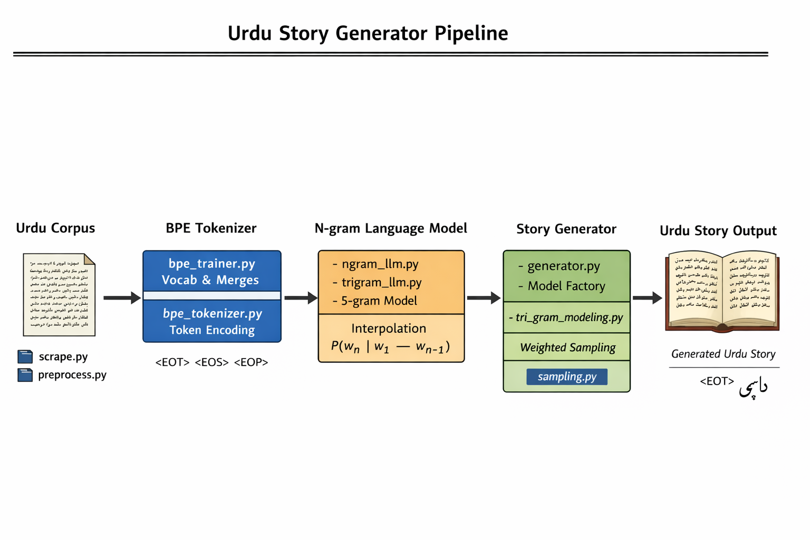

# Urdu Story Generator — Implementation Overview (Phase I → Phase III)



## 1. Project Overview

This project implements a **statistical Urdu story generation system** based on:

* Custom **Byte Pair Encoding (BPE) tokenizer**
* **N-gram Language Models** (Trigram, 5-gram, extensible to N-gram)
* Probabilistic text generation using interpolation and weighted sampling

The system is designed with **modularity and extensibility** in mind so that future upgrades (frontend integration, neural models, larger datasets) can be added without restructuring the core codebase.

---

## 2. System Architecture

The project follows a layered architecture:

```
Corpus → Preprocessing → Tokenizer → Language Model → Generator → Sampling → Output Story
```

### High-Level Pipeline

1. Load cleaned Urdu corpus (`Data/processed_stories.json`)
2. Preprocess text (`Preprocessing/preprocess.py`)
3. Convert text into BPE token IDs (`tokenizer/bpe_trainer.py`, `tokenizer/bpe_tokenizer.py`)
4. Train an N-gram language model (`models/ngram_llm.py`, `tri_gram_modeling.py`, `models/model_factory.py`)
5. Predict next tokens probabilistically (`generation/generator.py`)
6. Apply weighted sampling (`utils/sampling.py`)
7. Decode tokens back into Urdu text → Generated story

---

## 3. Phase I — Data Preparation

### Objective

Prepare a clean Urdu text corpus suitable for statistical language modeling.

### Steps Completed

* Urdu stories collected and normalized.
* Special structural tokens introduced:

  * `<EOT>` — Start/End of text
  * `<EOS>` — End of sentence
  * `<EOP>` — End of paragraph

### Output

```
Data/processed_stories.json
```

Each entry contains normalized story content used for tokenizer training.

---

## 4. Phase II — Custom BPE Tokenizer

### Motivation

Character-level modeling produces poor linguistic structure.
BPE allows learning **subword units** automatically.

### 4.1 BPE Training (`tokenizer/bpe_trainer.py`)

The trainer performs:

1. Character-level token initialization
2. Frequency counting of adjacent token pairs
3. Iterative merging of most frequent pairs
4. Vocabulary expansion until target size reached

#### Key Algorithms

* Pair frequency computation
* Greedy merge selection
* Special token protection (never merged)

#### Outputs

```
Data/vocab.json   → token_id → token mapping
Data/merges.json  → learned merge operations
```

Vocabulary size currently: 250 tokens

### 4.2 Runtime Tokenizer (`tokenizer/bpe_tokenizer.py`)

This module acts as an **adapter layer** between raw text and language models.

#### Responsibilities

* Preserve special tokens
* Encode text → token IDs
* Apply learned BPE merges sequentially
* Decode token IDs → text

#### Design Principle

Encoding applies merges. Decoding does **not** reverse merges because merged tokens already store final strings.

---

## 5. Phase III — Statistical Language Modeling

The system implements **interpolated N-gram language models**.

### 5.1 N-gram Concept

Probability estimation:

```
P(w_n | w_1 ... w_n-1)
```

Interpolation combines multiple contexts:

```
P = λ3 * Trigram + λ2 * Bigram + λ1 * Unigram
```

This reduces sparsity problems.

### 5.2 Trigram Model (`models/ngram_llm.py` / `tri_gram_modeling.py`)

Tracks:

* Unigram counts
* Bigram counts
* Trigram counts
* Total token count

Probability computed using linear interpolation weights:

```
LAMBDA_TRI, LAMBDA_BI, LAMBDA_UNI
```

### 5.3 Five-gram Model

Extension of trigram logic supporting longer context windows. Advantages:

* Better local coherence
* Improved phrase continuation

### 5.4 Generic Model Selection (`models/model_factory.py`)

Implements Factory Pattern:

```python
model = get_model("trigram")
model = get_model("5gram")
```

This enables future frontend integration without backend modification.

---

## 6. Story Generation Engine (`generation/generator.py`)

### Generation Algorithm

1. Start with initial context tokens.
2. Compute probability of every vocabulary token.
3. Sample next token using weighted sampling.
4. Append token to sequence.
5. Repeat until:

   * `<EOT>` generated, or
   * maximum length reached

### Generic Context Handling

Generator dynamically adapts to model order:

```
context = generated[-(model.n - 1):]
```

Allows trigram, 5-gram, or higher models to work without code changes.

### Sampling Strategy (`utils/sampling.py`)

Implemented features:

Weighted sampling (baseline)

Temperature scaling — controls randomness and creativity

Top-k sampling — restricts to most probable K tokens

Top-p (nucleus) sampling — restricts to cumulative probability mass for coherence

This ensures generated text is less noisy and more fluent while keeping diversity.

---

## 7. Training Entry Point (`train.py`)

Acts as orchestration layer.

### Responsibilities

* Load tokenizer
* Load corpus
* Encode dataset
* Select language model dynamically
* Train model
* Generate story

### Example Usage

```bash
python train.py --model trigram
python train.py --model 5gram
```

Start tokens are automatically adapted:

```
[EOT] * (model.n - 1)
```

---

## 8. Design Principles Applied

* **Modularity** — Each phase isolated into independent modules.
* **Extensibility** — New models require only a new model file and factory registration.
* **Separation of Concerns** — Tokenizer, model, and generation are independent layers.
* **Frontend Readiness** — Backend accepts dynamic model selection.

---

## 9. Current System Behavior

* Grammatically noisy but structurally Urdu-like output
* Expected due to small corpus size and limited vocabulary
* Confirms pipeline works correctly
* Much more coherent output due to temperature, top-k, and top-p sampling
* Reduced nonsensical words and token sequences

---

## 10. Future Improvements

* **Tokenization:** Larger BPE vocab (500–2000)
* **Architecture:** REST API backend, Web frontend model selector
* **Long-Term:** Transformer-based Urdu LM

---

## 11. Current Development Status

| Phase                 | Status     |
| --------------------- | ---------- |
| Data Collection       | ✅ Complete |
| Preprocessing         | ✅ Complete |
| BPE Training          | ✅ Complete |
| Tokenizer Integration | ✅ Complete |
| Trigram Model         | ✅ Complete |
| N-gram Model          | ✅ Complete |
| Generic Generator     | ✅ Complete |
| Model Factory         | ✅ Complete |
| Frontend Integration  | ⏳ Planned  |

---

## 12. Summary

The project successfully implements a **fully modular Urdu statistical text generation system**. The architecture now supports scalable experimentation with different language models while maintaining a clean and upgrade-friendly codebase.

The system is ready for:

* Frontend integration
